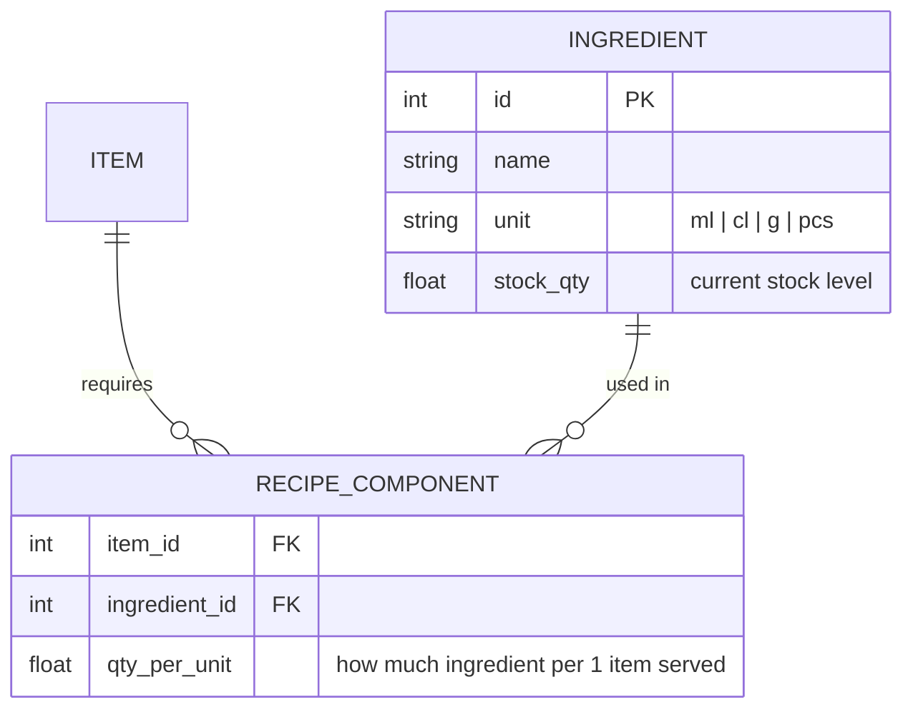

# System Architecture

## Technology Stack

| Component           | Technology              | Status         |
|---------------------|-------------------------|----------------|
| Backend API         | FastAPI + SQLModel      | ✅ Implemented  |
| Database ORM        | SQLModel (SQLAlchemy)   | ✅ Implemented  |
| Database            | PostgreSQL              | ✅ Implemented  |
| Migrations          | Alembic                 | ✅ Implemented  |
| Frontend (temp)     | Streamlit               | ✅ Implemented  |
| Frontend (planned)  | Web-based (SPA)         | ❌ Planned      |
| Real-time           | WebSocket               | ❌ Planned      |
| Background jobs     | Celery                  | ❌ Planned      |
| Caching             | Redis                   | ❌ Planned      |

---

## Request Flow

```
HTTP → FastAPI (app/main.py)
     → Router (app/api/router.py)
     → routes_v1.py
          → get_current_user (JWT validation, HTTPBearer)
          → TableService / AuthService (app/services/)
     → SQLModel session
     → PostgreSQL
```

---

## API Schema

All endpoints are versioned under `/api/v1/`.
Protected routes require `Authorization: Bearer <token>` header (JWT).

```
/api/v1/

  auth/                         ✅ Implemented
      POST   /login             Authenticate → access_token (12h) + refresh_token (30d)
                                  ⚠ Only unauthenticated endpoint; rate-limited 10/minute
      POST   /refresh           Exchange refresh_token → new access_token
      POST   /logout            Revoke refresh_token

  roles/                        ✅ Implemented
      POST   /                  Create role (name, description, permissions[])
      GET    /                  List roles
      GET    /{role_id}         Get role
      PATCH  /{role_id}         Update role
      DELETE /{role_id}         Delete role (blocked if users assigned or name="admin")

  users/                        ✅ Implemented
      POST   /                  Create user
      GET    /                  List users  (filter: ?name=)
      GET    /{user_id}         Get user
      PUT    /{user_id}         Update user (name, username, password, role_id)
      DELETE /{user_id}         Delete user

  items/                        ✅ Implemented
      POST   /                  Create menu item
      GET    /                  List items  (filter: ?name=, ?category=, ?available_only=)
      GET    /{item_id}         Get item
      PUT    /{item_id}         Update item
      DELETE /{item_id}         Delete item
      PATCH  /{item_id}/stock   Adjust stock delta (positive = add, negative = remove)

  tables/                       ✅ Implemented  ("table" = one customer session / tab)
      POST   /                  Open table
      GET    /                  List tables  (filter: ?status=Active|Closed)
      GET    /{table_id}        Get table + nested orders
      PATCH  /{table_id}        Rename / update table
      POST   /{table_id}/close  Close table and lock bill total
      GET    /{table_id}/receipt Download PDF receipt (A6, Unicode, Cyrillic-ready)
      DELETE /{table_id}        Delete table

  tables/{table_id}/orders/     ✅ Implemented
      POST   /                  Add item to table (deducts stock if tracked)
      GET    /                  List orders for table
      GET    /{order_id}        Get order line
      PATCH  /{order_id}        Update quantity (adjusts stock delta)
      DELETE /{order_id}        Cancel order line

  items/{item_id}/recipe        ← Phase 2 (planned)
      GET    /                  Get recipe (ingredient list)
      PUT    /                  Set / update recipe

  stats/                        ✅ Implemented
      GET    /daily             Daily summary  (?date=YYYY-MM-DD, defaults today)

  audit/                        ✅ Implemented
      GET    /events            Query audit log  (?action=, ?limit=, requires roles perm)

  payments/                     ← Phase 6 (planned)
      POST   /                  Process payment for a table
      GET    /                  List payments  (filter: date, method)
      GET    /{payment_id}      Get payment receipt
```

---

## Stats Response — `GET /api/v1/stats/daily`

```json
{
  "date": "2026-04-13",
  "revenue_total": 125.50,
  "revenue_locked": 80.00,    // from already-closed tables
  "revenue_running": 45.50,   // from still-active tables
  "orders_count": 12,
  "tables_served": 4,
  "items_sold": [
    { "item_name": "Beer",    "quantity": 8.0, "revenue": 40.00 },
    { "item_name": "Nachos",  "quantity": 3.0, "revenue": 36.00 }
  ],
  "orders_log": [
    {
      "order_id": 1,
      "created_at": "2026-04-13T18:30:00",
      "table_name": "Table 1",
      "item_name": "Beer",
      "quantity": 2.0,
      "price": 5.00,
      "line_total": 10.00
    }
  ]
}
```

`items_sold` is sorted by `revenue` descending. `orders_log` is sorted chronologically.

---

## DB Schema

### Phase 1 + 2 + 3 — Core (current)

```mermaid
erDiagram
    ROLE {
        int     id          PK
        string  name        "admin | manager | barman | cook"
        string  description
        string  permissions "JSON-encoded list: [\"tables\",\"items\",...]"
    }

    USER {
        int     id            PK
        string  name
        string  username      "login identifier (unique)"
        string  password_hash "bcrypt"
        int     role_id       FK
    }

    ITEM {
        int     id          PK
        string  name
        float   price       "current list price"
        string  category    "beer | cocktail | food | ..."
        bool    is_available
        float   stock_qty   "null = not tracked"
        datetime created_at
        datetime updated_at
    }

    TABLE {
        int     id          PK
        string  table_name  "human label: Table 3, Bar Tab..."
        string  status      "Active | Closed"
        float   total       "locked bill total (set on close)"
        datetime created_at
        datetime updated_at
        datetime closed_at  "null while active"
    }

    ORDER {
        int     id          PK
        int     table_id    FK
        int     item_id     FK
        float   quantity
        float   price       "snapshot of price at order time"
        datetime created_at
    }

    REFRESH_TOKEN {
        int      id           PK
        string   token        "urlsafe random 32-byte string (unique)"
        int      user_id      FK
        datetime expires_at   "now + 30 days"
        datetime revoked_at   "null until logout"
        datetime created_at
    }

    AUDIT_EVENT {
        int      id           PK
        int      user_id      "null for unauthenticated actions"
        string   username
        string   action       "login_success | login_failure | ..."
        int      resource_id  "null for non-resource actions"
        string   ip           "client IP (max 45 chars for IPv6)"
        datetime created_at
    }

    ROLE  ||--o{ USER          : "assigned to"
    TABLE ||--o{ ORDER         : "contains"
    ITEM  ||--o{ ORDER         : "referenced by"
    USER  ||--o{ REFRESH_TOKEN : "owns"
```

> `ORDER.price` locks the price at the moment of ordering so later price
> changes do not affect open or past bills.

**Available permissions:** `tables`, `items`, `stock`, `stats`, `users`, `roles`

---

### Phase 2 — Stock & Recipes



When an order is placed, `qty_per_unit × quantity` is deducted from
`INGREDIENT.stock_qty` for every component in the recipe.

---

### Phase 3 — Auth & Shifts

Auth with RBAC is **implemented** (see current schema above).
`is_active` flag and Shifts table are still planned:

```
SHIFT                             ← planned
  id         PK
  user_id    FK → USER
  opened_at  datetime
  closed_at  datetime   (null while shift is open)
```

---

### Phase 6 — Payments

```
PAYMENT
  id             PK
  table_id       FK → TABLE
  amount         float
  method         enum: cash | card | tab
  processed_at   datetime
  processed_by   FK → USER   (null until auth is added)
```

A table can only be closed after a payment record exists for the full
bill amount. Partial payments (split bills) will be one payment row each.

---

## Backlog

See implementation status table in `README.md`.
