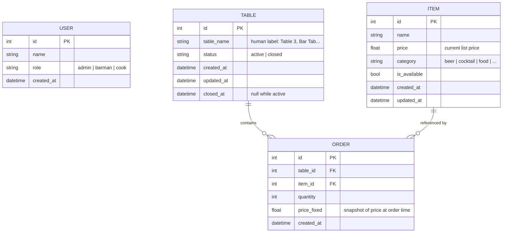
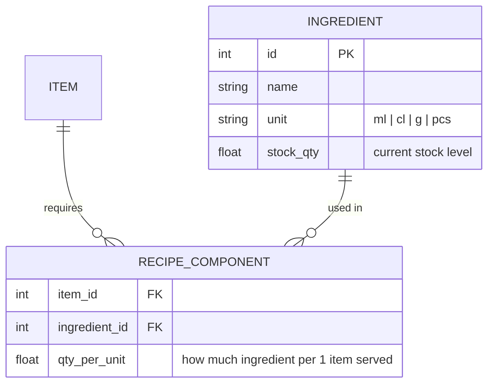

# System Architecture

## Technology Stack

| Component           | Technology              | Status         |
|---------------------|-------------------------|----------------|
| Backend API         | FastAPI + SQLModel      | ✅ Implemented  |
| Database ORM        | SQLModel (SQLAlchemy)   | ✅ Implemented  |
| Database            | PostgreSQL              | ✅ Implemented  |
| Migrations          | Alembic                 | ✅ Implemented  |
| Frontend (temp)     | Streamlit               | ✅ Implemented  |
| Frontend (planned)  | Web-based (SPA)         | ❌ Planned      |
| Real-time           | WebSocket               | ❌ Planned      |
| Background jobs     | Celery                  | ❌ Planned      |
| Caching             | Redis                   | ❌ Planned      |

---

## Request Flow

```
HTTP → FastAPI (app/main.py)
     → Router (app/api/router.py)
     → new_routes.py
     → TableService (app/services/table_service.py)
     → SQLModel session
     → PostgreSQL
```

---

## API Schema

All endpoints are versioned under `/api/v1/`.

```
/api/v1/

  users/
      POST   /                  Create user
      GET    /                  List users
      GET    /{user_id}         Get user
      PUT    /{user_id}         Update user
      DELETE /{user_id}         Delete user

  auth/                         ← Phase 3
      POST   /login             Authenticate → token
      POST   /logout            Invalidate token
      GET    /me                Current user info

  items/
      POST   /                  Create menu item
      GET    /                  List items  (filter: category, available)
      GET    /{item_id}         Get item
      PUT    /{item_id}         Update item (price, availability)
      DELETE /{item_id}         Delete item

  tables/                       ← "table" = one customer session / tab
      POST   /                  Open table
      GET    /                  List tables  (filter: status=active|closed)
      GET    /{table_id}        Get table + order summary
      PATCH  /{table_id}        Rename / update table
      POST   /{table_id}/close  Close table and lock bill
      DELETE /{table_id}        Delete table

  tables/{table_id}/orders/
      POST   /                  Add item to table
      GET    /                  List orders for table
      GET    /{order_id}        Get order line
      PATCH  /{order_id}        Update quantity
      DELETE /{order_id}        Cancel order line

  ingredients/                  ← Phase 2
      POST   /                  Add ingredient
      GET    /                  List ingredients with stock levels
      PUT    /{ingredient_id}   Update ingredient / restock
      DELETE /{ingredient_id}   Remove ingredient

  items/{item_id}/recipe        ← Phase 2
      GET    /                  Get recipe (ingredient list)
      PUT    /                  Set / update recipe

  stats/
      GET    /daily             Daily summary  (?date=YYYY-MM-DD, defaults today)

  audit/                        ← Phase 5
      GET    /                  Query audit log  (filter: entity, actor, date)

  payments/                     ← Phase 6
      POST   /                  Process payment for a table
      GET    /                  List payments  (filter: date, method)
      GET    /{payment_id}      Get payment receipt
```

---

## Stats Response — `GET /api/v1/stats/daily`

```json
{
  "date": "2026-04-13",
  "revenue_total": 125.50,
  "revenue_locked": 80.00,    // from already-closed tables
  "revenue_running": 45.50,   // from still-active tables
  "orders_count": 12,
  "tables_served": 4,
  "items_sold": [
    { "item_name": "Beer",    "quantity": 8.0, "revenue": 40.00 },
    { "item_name": "Nachos",  "quantity": 3.0, "revenue": 36.00 }
  ],
  "orders_log": [
    {
      "order_id": 1,
      "created_at": "2026-04-13T18:30:00",
      "table_name": "Table 1",
      "item_name": "Beer",
      "quantity": 2.0,
      "price": 5.00,
      "line_total": 10.00
    }
  ]
}
```

`items_sold` is sorted by `revenue` descending. `orders_log` is sorted chronologically.

---

## DB Schema

### Phase 1 — Core (current)



> `price_fixed` is critical: it locks the price at the moment of ordering so
> later price changes do not affect open or past bills.

---

### Phase 2 — Stock & Recipes



When an order is placed, `qty_per_unit × quantity` is deducted from
`INGREDIENT.stock_qty` for every component in the recipe.

---

### Phase 3 — Auth & Shifts

Additions to `USER`:

| Column        | Type   | Note                      |
|---------------|--------|---------------------------|
| password_hash | string | bcrypt                    |
| is_active     | bool   | soft-disable accounts     |

New table:

```
SHIFT
  id         PK
  user_id    FK → USER
  opened_at  datetime
  closed_at  datetime   (null while shift is open)
```

---

### Phase 5 — Audit Log

```
AUDIT_LOG
  id           PK
  timestamp    datetime
  actor_id     FK → USER   (null for system actions)
  action       enum: CREATE | UPDATE | DELETE
  entity_type  string      (table, order, item, payment, ...)
  entity_id    int
  payload      json        (before/after diff or full snapshot)
```

All money- and stock-affecting writes go through the audit log.

---

### Phase 6 — Payments

```
PAYMENT
  id             PK
  table_id       FK → TABLE
  amount         float
  method         enum: cash | card | tab
  processed_at   datetime
  processed_by   FK → USER   (null until auth is added)
```

A table can only be closed after a payment record exists for the full
bill amount. Partial payments (split bills) will be one payment row each.
