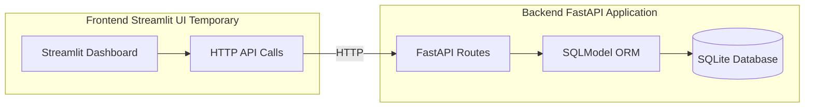
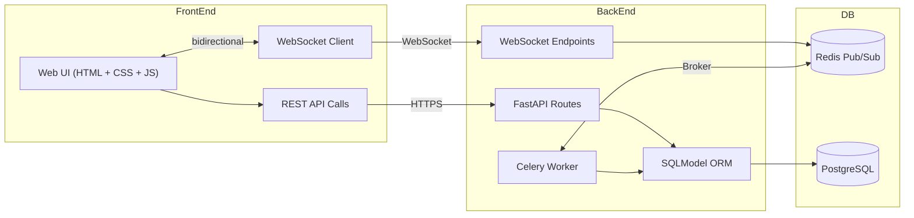
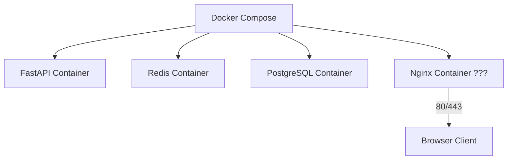

# System Architecture

> **Scope:** single‑bar deployment (one local server), current implementation with FastAPI + SQLModel.

---

## 1. Current Architecture



* **Frontend (Temporary):** Streamlit-based UI for rapid prototyping and testing
* **Backend API:** FastAPI with automatic OpenAPI documentation  
* **Database:** SQLModel ORM with SQLite for development
* **No real-time features yet:** WebSocket, Redis, and background jobs planned for future

---

## 2. Current Component Responsibilities

| Component | Technology | Current Responsibilities |
| --------- | ---------- | ----------------------- |
| **Streamlit UI** | Streamlit | Client management, order creation, basic CRUD operations |
| **FastAPI Backend** | FastAPI | REST API endpoints, request validation, business logic |
| **SQLModel ORM** | SQLModel | Database models, relationships, query building |
| **SQLite Database** | SQLite | Data persistence for development |

---

## 3. Planned Architecture (Future)



**Planned additions:**
* **Web-based UI:** Replace Streamlit with proper web interface
* **WebSocket:** Real-time order updates
* **Redis:** Message broker and caching
* **PostgreSQL:** Production database
* **Celery:** Background tasks (reports, notifications)

---

## 4. Current API Structure

### Implemented Endpoints

| Endpoint | Method | Description |
| -------- | ------ | ----------- |
| `/` | GET | Health check |
| `/api/clients/` | GET, POST | Client management |
| `/api/items/` | GET, POST | Item management |
| `/api/orders/` | GET, POST | Order management |

### API Documentation

FastAPI automatically generates OpenAPI documentation at `/docs` and `/redoc`.

---

## 5. Deployment (Current)

### Development Setup

```bash
# Backend
cd app/
python3 -m venv .venv
source .venv/bin/activate
pip install -r requirements.txt
fastapi dev main.py

# Frontend (separate terminal)
cd frontend/
python3 -m venv .venv
source .venv/bin/activate
pip install -r requirements.txt
streamlit run front.py
```

### Planned Production Setup



---

## 6. Development Status

### ✅ Implemented

- Basic FastAPI application structure
- SQLModel database models
- CRUD operations for clients, items, orders
- Streamlit frontend for testing
- Basic API endpoints

### ❌ Not Yet Implemented

- User authentication and authorization
- WebSocket real-time updates
- Background job processing
- Stock management
- Payment processing
- Recipe components
- Audit logging
- Production deployment setup

---

**Next Steps:**
1. Implement user authentication system
2. Add stock management models
3. Create payment processing system
4. Replace Streamlit with web-based UI
5. Add WebSocket support for real-time updates
